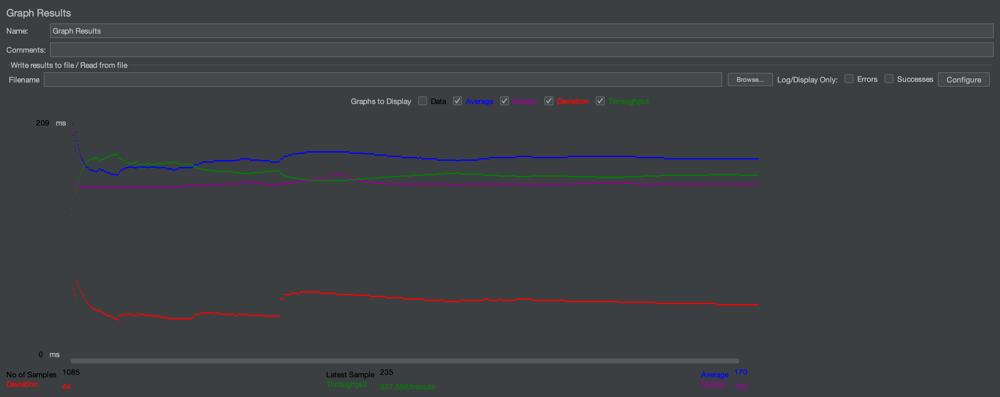
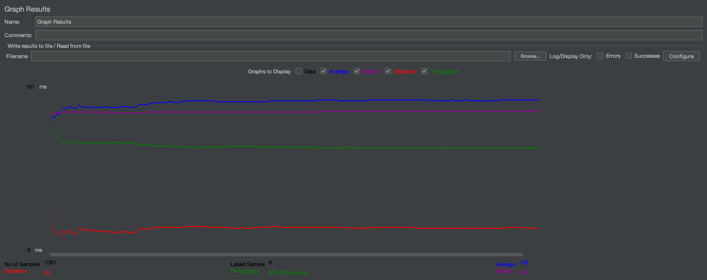
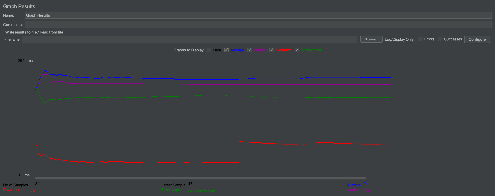

# 2023-fall-cs122b-team-winner

AWS LINKS

Single (with https): https://3.22.101.185:8443/fabflix/login.html

Load Balancer (Port 80): http://18.219.176.42/fabflix/

Master: http://18.189.32.191:8080/fabflix/

Slave: http://13.59.117.29:8080/fabflix/

- # General
    - #### Team#: Team Winner
    
    - #### Names: Brian L, Henry R
    
    - #### Project 5 Video Demo Link: https://youtu.be/vBw9oilsPaM

    - #### Instruction of deployment:
  
  -mvn package
  -sudo cp ./target/*.war /var/lib/tomcat10/webapps/
  
  

    - #### Collaborations and Work Distribution: 

        Brian: Task 1, 2, 3, Jmeter for Master/Slave
        Henry: Task 4.1, 4.2, Jmeter for Single Instance

- # Connection Pooling
    - #### Include the filename/path of all code/configuration files in GitHub of using JDBC Connection Pooling.
    
    - #### Explain how Connection Pooling is utilized in the Fabflix code.
Connection Pooling is defined in the context.xml for each resource. Whenever a connection is not in use, it sits idle until it is reused again in a servlet or if max idle connection is above 30. The pool of connections will never exceed 100 for each resource. An advantage of reusing connections is that a user would not have to wait for JDBC to create another connection to the database, reducing Servet Time. 
      
    
    - #### Explain how Connection Pooling works with two backend SQL.
          There are 2 resources provided in the context.xml. Each backend server has access to its own connection pool for each resource defined. This means that the connections aren't shared between the two backend servers. 
    

- # Master/Slave
    - #### Include the filename/path of all code/configuration files in GitHub of routing queries to Master/Slave SQL.

    - #### How read/write requests were routed to Master/Slave SQL?
          Master instance is routed to its own Master database (localhost)
          Slave instance its routed to the Master database for any servlets requiring write and any servlets that only read is routed to the Slave (localhost) database.
 
      
          Master is not routed to the Slave database for reads because there is a significant amount of read operations compared to write and to help balance out the load on the SQL servers, we made Master only route to its own Master database for reads and writes.
    

- # JMeter TS/TJ Time Logs
    - #### Instructions of how to use the `log_processing.*` script to process the JMeter logs.
    -     On Intelij, edit configurations for src/ProcessTimeLog.java and include any arguments, and run. 
    -     Arguments to this program are the file paths of the logs. Including multiple paths will calculate the averages of both as if the files were combined.

- # JMeter TS/TJ Time Measurement Report

  Note: Click on the image to redirect to the path

| **Single-instance Version Test Plan**          | **Graph Results Screenshot** | **Average Query Time(ms)** | **Average Search Servlet Time(ms)** | **Average JDBC Time(ms)** | **Analysis** |
|------------------------------------------------|------------------------------|----------------------------|-------------------------------------|---------------------------|--------------|
| Case 1: HTTP/1 thread                          |    | 151                         | 2.11                                 | 1.93                         | With only one thread being tested, along with connection pooling, this test is to be expected to take the shortest amount of time in terms of query and servlet time.           |
| Case 2: HTTP/10 threads                        |    | 159                         | 2.21                                  |  2.01                       | These results are similar to a single thread, just slower, which is to be logically expected.            |
| Case 3: HTTPS/10 threads                       |   | 241                         | 2.19                                  | 1.80                       | With https, the higher query time is correlated with the overhead of the encryption/decryption of data. With 10 threads, the server deals with handling concurrent TLS handshakes.        |
| Case 4: HTTP/10 threads/No connection pooling  |    | 169                         | 4.45                                  | 4.29                       | Due to the lack of connection pool/cache, it is to be expected that this test of fablix takes the longest in terms of JDBC and servlet times.        |

| **Scaled Version Test Plan**                   | **Graph Results Screenshot** | **Average Query Time(ms)** | **Average Search Servlet Time(ms)** | **Average JDBC Time(ms)** | **Analysis** |
|------------------------------------------------|------------------------------|----------------------------|-------------------------------------|---------------------------|--------------|
| Case 1: HTTP/1 thread                          |    | 171                         | 2.45                                  | 2.17                        | ??           |
| Case 2: HTTP/10 threads                        |    | 166                         | 3.80                                  | 3.57                        | ??           |
| Case 3: HTTP/10 threads/No connection pooling  |    | 164                         | 6.10                                  | 2.60                        | Due to the lack of connection pool/cache, it is to be expected that this test of fablix takes the longest in terms of JDBC and servlet times. The black points on the graph further indicate the strain on the server.           |

Fabflix URL: [[https://13.58.62.187:8443/fabflix/index.html](https://13.59.221.90:8443/fabflix/)](https://18.219.176.42:8443/fabflix/)

Video URL: https://youtu.be/WjDXl1xrIYE

## Project 4

Brian Le: Task 1
Henry Reyes: Task 2

## Project 3

Video URL: https://youtu.be/l7qm-j3WspI

Brian Le (bale4): Task 1 Adding reCaptcha, Task 2 Adding HTTPS, Task 6 Importing large XML data files into the Fabflix database

Henry Reyes (henreyes): 
    - Task 3 Use PreparedStatement (files: EmployeeLogin.java, LoginServlet.java, CartItemServlet.java, BrowseServlet.java, MoviesServlet.java MoviesListServlet.Java, 
      PaymentServlet.java, SingleMovieServlet.java, SingleStarServlet.java) 
    - Task 4  Use Encrypted Password
    - Task 5 Implementing a Dashboard using Stored Procedure

Parser Optimization:

Multi Threading for inserting into query. (Time before on EC2 - 60 seconds)

Creating objects for each star/movie and storing them into Hashmaps instead of ArrayList to quickly find duplicates for movies and stars. (Time before on EC2 - 270 seconds)

Inconsistent File: inconsistent.txt

Inconsistency is determined if for movie, year is not formatted correctly, or any field is missing. For Actors/Casts, inconsistent if any field other than year is missing or can't parse. Actors not in Cast will still be added to the db

## Project 2
Project 2 Demo Video URL: https://www.youtube.com/watch?v=A2W_HyDl1sE&ab_channel=BrianLe

Brian Le (bale4): Task 2 Implement the Main Page (with Search and Browse) and Task 3 Extend Project 1

Henry Reyes (henreyes): Task 1 Implement the Login Page and Task 4 Implement the Shopping Cart

### Substring matching:
Line 137 in src/MoviesServlet is the search query. Below is the Where statement of SQL that searches

    WHERE m.id is not null" + movie_name_cond + director_cond + year_cond + star_name_cond

The variables are set in lines 77-88 of src/MoviesServlet if their parameters are passed in. 

If movie name (a), director (b), year (c), and star (d) are all defined, then the Where condition will be

    WHERE m.id is not null and m.title LIKE '%a%' and m.director LIKE '%b%' and m.year = c and s.name = '%d%'
    

Below is the nested query that returns the ids based on the search 

"SELECT DISTINCT m.id as id, r.rating as rating, count(*) OVER() AS total_rows\n" +

"FROM movies m\n" +

"LEFT JOIN ratings r ON r.movieId = m.id\n" +

"LEFT JOIN stars_in_movies sm ON sm.movieId = m.id\n" +

"LEFT JOIN stars s ON sm.starId = s.id\n" +

"WHERE m.id is not null" + movie_name_cond + director_cond + year_cond + star_name_cond + "\n" +

"GROUP BY m.id\n" +

"ORDER BY " + firstOrder + "\n" +

"LIMIT ? OFFSET ?"

## Project 1
Project 1 Demo Video URL: https://youtu.be/f_cJnsWaG3c

Brian Le (bale4): Wrote MySQL table schema, Created Single Movie List page and Home Page, Styling tables, and Deployed on AWS

Henry Reyes (henreyes): Wrote MySQL queries for Movie list and Single Movie, java servlets, and javascript 

## Special Instructions: 

Change Username/Password in context.xml to match user with access to moviedb database

Instead of "cp ./target/*.war /var/lib/tomcat10/webapps/", used "sudo cp ./target/*.war /var/lib/tomcat10/webapps/"
